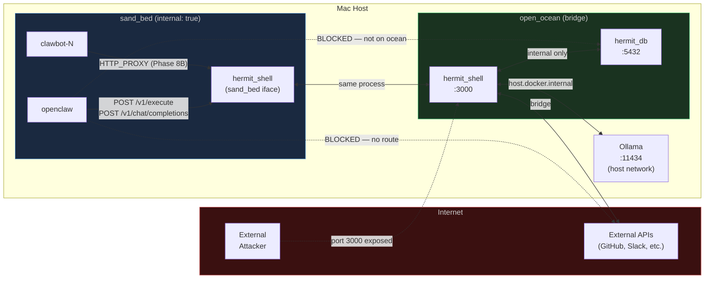
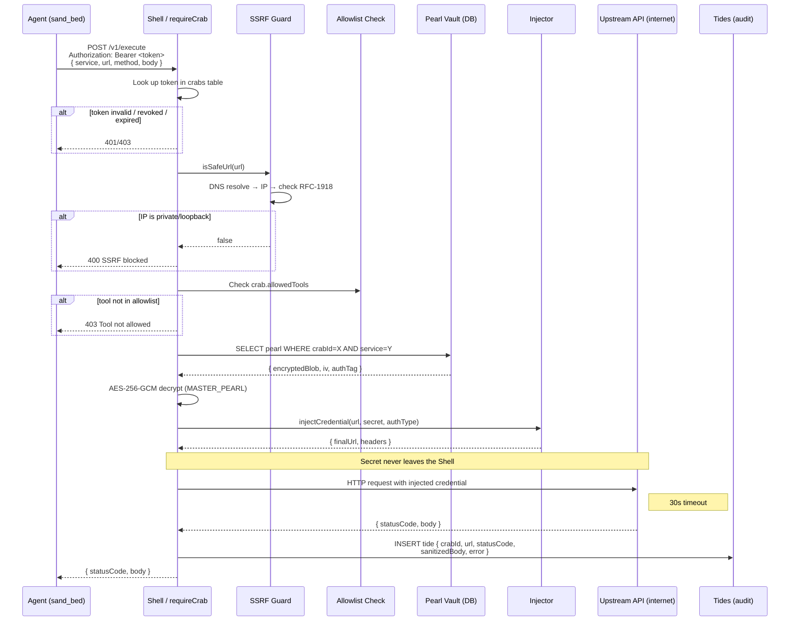
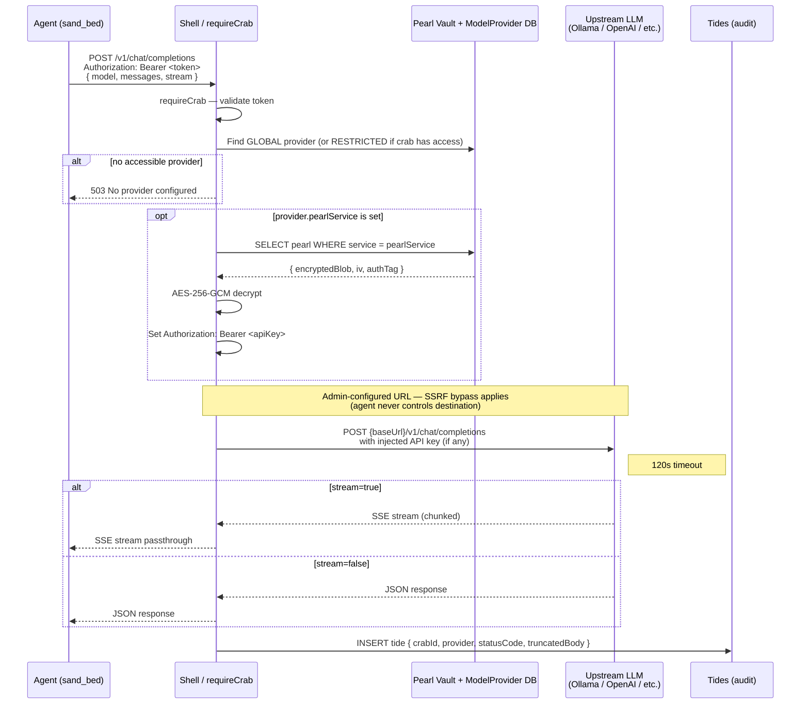
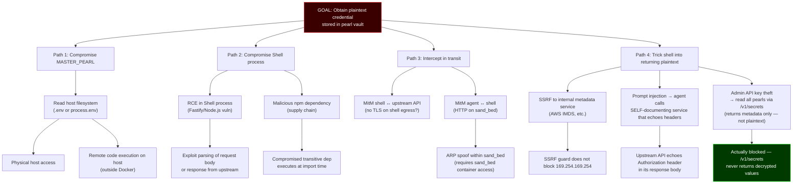
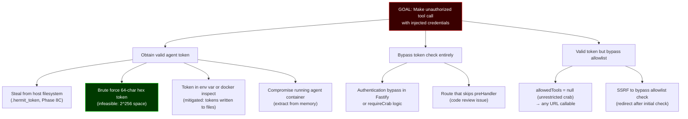
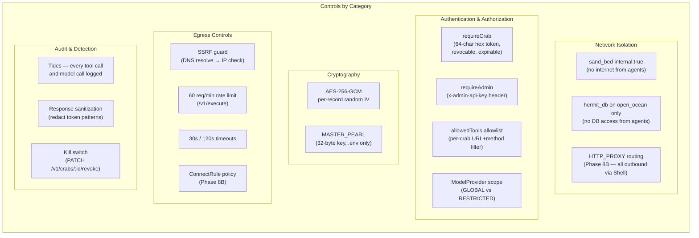

# HermitClaw — Threat Model

> **Date:** 2026-02-17
> **Version:** Covers Phases 0–8A (model proxy). CONNECT proxy and provisioning scripts (8B–8C) are design-complete but not yet built.
> **Methodology:** STRIDE per-component + attack tree analysis for high-value assets.

---

## 1. System Overview

HermitClaw is a self-hosted security gateway that stands between AI agent containers and the outside world. Agents have zero direct internet access; every outbound call, model inference, and credential use is mediated by the Hermit Shell.

```mermaid
flowchart TB
    subgraph Host["Mac Host (Docker runtime)"]
        Ollama["Ollama\nport 11434"]

        subgraph OceanNet["open_ocean (bridge — internet access)"]
            Shell["hermit_shell :3000\nFastify gateway"]
            DB["hermit_db :5432\nPostgreSQL vault"]
        end

        subgraph BedNet["sand_bed (internal — NO internet)"]
            Shell2["hermit_shell :3000\n(also on sand_bed)"]
            Agent1["openclaw\ncontainer"]
            Agent2["clawbot-N\ncontainer"]
        end
    end

    Browser["Browser\n(admin)"] -->|"HTTP localhost:3000"| Shell
    Shell -->|SQL| DB
    Shell -->|"http://host.docker.internal:11434"| Ollama
    Shell -->|"HTTPS (outbound tools)"| Internet["Internet\nAPIs"]
    Agent1 -->|"Bearer token"| Shell2
    Agent2 -->|"Bearer token"| Shell2
    Shell2 -.->|same process| Shell

    style BedNet fill:#1a2940,stroke:#4a8cc7
    style OceanNet fill:#1a3320,stroke:#4ac77a
    style Host fill:#111,stroke:#555
```

**Key isolation invariant:** `hermit_db` is on `open_ocean` only. Agent containers are on `sand_bed` only. There is no network path from any agent container to the database.

---

## 2. Network Topology

---

## 3. Trust Boundaries and Zones

```mermaid
flowchart TD
    subgraph Z1["Trust Zone 0 — Full trust (host)"]
        Host[".env\nMASTER_PEARL\nADMIN_API_KEY\nHost filesystem"]
    end

    subgraph Z2["Trust Zone 1 — Admin-authenticated"]
        AdminUI["Tide Pool UI\n(browser session)"]
        AdminAPI["Management API\n/v1/crabs, /v1/secrets\n/v1/providers, /v1/tides"]
    end

    subgraph Z3["Trust Zone 2 — Shell internals"]
        Vault["Pearl Vault\nAES-256-GCM encrypted"]
        Gateway["Execute Gateway\n/v1/execute\n/v1/chat/completions"]
        AuditLog["Tides (audit log)"]
    end

    subgraph Z4["Trust Zone 3 — Agent (low trust)"]
        Agent["Agent container\n(sand_bed only)"]
        Token["Bearer token\n(64-char hex)"]
    end

    subgraph Z5["Trust Zone 4 — External (untrusted)"]
        Internet["Internet\nAPIs + adversaries"]
    end

    Z1 -->|"derives"| Z2
    Z2 -->|"manages"| Z3
    Z4 -->|"calls via token"| Z3
    Z3 -->|"proxied, audited"| Z5
    Z4 -. "cannot reach" .-> Z5
    Z4 -. "cannot reach" .-> Z1

    style Z1 fill:#2d1a00,stroke:#ff9900
    style Z2 fill:#1a2d00,stroke:#66ff00
    style Z3 fill:#00182d,stroke:#0099ff
    style Z4 fill:#2d002d,stroke:#ff00ff
    style Z5 fill:#2d0000,stroke:#ff0000
```

**Trust boundary crossings are where vulnerabilities live.** HermitClaw's controls are concentrated at Z4→Z3 and Z3→Z5.

---

## 4. Data Flows

### 4A. Tool Call (POST /v1/execute)

**Critical controls on this path:**
- Token validation (who is calling)
- SSRF guard (where they can call)
- Allowlist check (what they can call)
- Credential never transmitted to agent
- Every call audited

---

### 4B. Model Proxy (POST /v1/chat/completions)

**Key difference from execute:** The upstream URL is **admin-controlled** (stored in `model_providers` table), not agent-controlled. The agent only specifies messages + parameters, never the destination. This is why the SSRF guard is bypassed — the attack surface is admin-misconfiguration, not prompt injection.

---

### 4C. Credential at Rest

```mermaid
flowchart LR
    subgraph AdminWrite["Admin: POST /v1/secrets"]
        PT["plaintext secret\n(in request body over HTTP)"]
    end

    subgraph Encryption["Shell — crypto.ts"]
        IV["random IV\n(16 bytes, crypto.randomBytes)"]
        KEY["MASTER_PEARL\n(32-byte hex from .env)"]
        PT --> ENC["AES-256-GCM\nencrypt"]
        IV --> ENC
        KEY --> ENC
        ENC --> BLOB["encryptedBlob (hex)"]
        ENC --> TAG["authTag (hex)"]
    end

    subgraph DB["hermit_db — pearls table"]
        ROW["{ encryptedBlob, iv, authTag }\nNO plaintext"]
        BLOB --> ROW
        TAG --> ROW
        IV --> ROW
    end

    subgraph Decryption["Shell — execute / model routes"]
        ROW --> DEC["AES-256-GCM\ndecrypt"]
        KEY2["MASTER_PEARL\n(from process.env)"] --> DEC
        DEC --> PT2["plaintext\n(in memory only)"]
        PT2 --> INJ["injected into\noutbound request"]
    end

    style DB fill:#1a2940,stroke:#4a8cc7
    style Encryption fill:#1a3320,stroke:#4ac77a
    style Decryption fill:#2d1a00,stroke:#ff9900
```

**The MASTER_PEARL is the single key protecting all secrets.** It is never written to the DB. Host compromise = vault compromise. This is an accepted, documented tradeoff of the self-hosted model.

---

## 5. Assets and Threat Actors

### High-Value Assets

| Asset | Location | Value | If Compromised |
|-------|----------|-------|----------------|
| `MASTER_PEARL` | `.env` / `process.env` | Critical | All credentials decryptable |
| `ADMIN_API_KEY` | `.env` / `process.env` | Critical | Full management control |
| Pearl vault (DB rows) | `hermit_db` | High | Encrypted; useless without MASTER_PEARL |
| Agent tokens (crabs table) | `hermit_db` | Medium | Per-agent tool call impersonation |
| Tides audit log | `hermit_db` | Medium | Evidence tampering |
| LLM model context / conversations | Memory + tides | Medium | Privacy / confidentiality |

### Threat Actors

```mermaid
flowchart LR
    subgraph Actors["Threat Actors"]
        TA1["TA1: Prompt-injected agent\n(AI model output manipulates\nthe agent into bad tool calls)"]
        TA2["TA2: External attacker\n(internet-facing, port 3000)"]
        TA3["TA3: Malicious insider\n(has ADMIN_API_KEY)"]
        TA4["TA4: Supply chain\n(compromised npm package)"]
        TA5["TA5: Compromised host\n(physical or remote code exec)"]
    end

    subgraph Reach["What they can reach"]
        R1["/v1/execute API\n(with valid agent token)"]
        R2["Port 3000\n(unauthenticated routes)"]
        R3["Full admin API\nAll management routes"]
        R4["Node.js process memory\nAll env vars"]
        R5["Host filesystem\n.env, MASTER_PEARL"]
    end

    TA1 -->|"via token they hold"| R1
    TA2 -->|"network access"| R2
    TA3 -->|"key in hand"| R3
    TA4 -->|"code runs in process"| R4
    TA5 -->|"full access"| R5

    style TA1 fill:#3a1a00,stroke:#ff8800
    style TA2 fill:#3a0000,stroke:#ff0000
    style TA3 fill:#2d002d,stroke:#ff00ff
    style TA4 fill:#001a2d,stroke:#0088ff
    style TA5 fill:#1a0000,stroke:#cc0000
```

---

## 6. STRIDE Analysis

### 6A. Shell (hermit_shell — the gateway process)

| Threat | Description | Controls in Place | Residual Risk |
|--------|------------|-------------------|---------------|
| **S** Spoofing | Agent impersonation via forged token | Token is 64-char random hex, validated in DB on every request; no JWT so no algorithm confusion | Token theft enables impersonation |
| **S** Spoofing | Admin impersonation | `x-admin-api-key` header checked on all management routes | Key in transit over plaintext HTTP (no TLS by default) |
| **T** Tampering | Agent manipulates outbound request | Shell constructs final URL + headers; agent controls `service`, `url`, `method`, `body` only | Agent controls `url` parameter (SSRF guard mitigates) |
| **T** Tampering | Audit log manipulation | Shell is sole writer to tides; no agent-accessible write path | Admin with DB access can alter rows |
| **R** Repudiation | Agent denies making a call | Every request logged with `crabId`, `targetUrl`, `statusCode` | Admin actions are not logged — gap |
| **I** Info disclosure | Credential leakage in audit log | `sanitizeResponseBody()` redacts token/key patterns from response bodies | Regex-based redaction can be bypassed with unusual key names |
| **I** Info disclosure | Credential in transit (shell ↔ agent) | Shell never sends credential to agent; only response body returned | HTTP (no TLS) between agent and shell on sand_bed |
| **I** Info disclosure | Credential in transit (shell ↔ upstream) | Standard HTTPS to upstream APIs | N/A — upstream TLS |
| **D** DoS | Runaway agent exhausting rate limits | 60 req/min per crab on `/v1/execute` | No rate limit on `/v1/chat/completions` — gap |
| **D** DoS | Slow upstream hanging connections | 30s timeout on `/v1/execute`; 120s on model proxy | Long-lived connections possible under model proxy |
| **E** Elevation | SSRF to internal services | `isSafeUrl()` resolves DNS, checks RFC-1918 + loopback ranges | DNS TOCTOU window (resolve ≠ connect); SSRF via IPv6 expansion |
| **E** Elevation | Agent accesses admin routes | Admin routes require `x-admin-api-key`; agent token gives no access | N/A — clean separation |

### 6B. Pearl Vault (hermit_db — PostgreSQL)

| Threat | Description | Controls in Place | Residual Risk |
|--------|------------|-------------------|---------------|
| **S** Spoofing | Unauthorized DB connection | DB on `open_ocean` only; agent containers on `sand_bed` only | DB port 5432 exposed on host (docker-compose.yml line 30) |
| **T** Tampering | Row modification | DB password required; no network path from agents | Admin with DB access could modify pearls |
| **I** Info disclosure | Credential exfiltration from DB | All pearls AES-256-GCM encrypted; IV + authTag stored per row | DB dump useless without MASTER_PEARL |
| **D** DoS | Resource exhaustion | Postgres connection pool | N/A for self-hosted single-user |
| **E** Elevation | Lateral movement from DB to shell | No reverse connection mechanism in Postgres | N/A |

### 6C. Agent Container

| Threat | Description | Controls in Place | Residual Risk |
|--------|------------|-------------------|---------------|
| **S** Spoofing | Impersonate another agent | Each agent has distinct token; no shared tokens | Token written to host filesystem (acceptable tradeoff) |
| **T** Tampering | Modify outbound request post-injection | Agent never sees credential; shell constructs final request | N/A |
| **I** Info disclosure | Discover sibling agent identities | Agents can only call `/v1/execute` — no discovery route | Shared sand_bed network; ARP scanning within network possible |
| **D** DoS | Exhaust shell resources | Rate limiting per crab | Container resource limits are provisioning-time config (not yet enforced) |
| **E** Elevation | Escape to internet directly | sand_bed is `internal: true` — no gateway | N/A — Docker network enforcement |
| **E** Elevation | Reach hermit_db | hermit_db not on sand_bed | N/A — separate network |

---

## 7. Attack Trees

### 7A. Credential Exfiltration (highest value attack)

**Most credible paths:** P1A2 (host RCE) and P2B (supply chain). Both require compromise outside Docker's isolation boundary. P4B (header reflection) is the most realistic in-band attack.

### 7B. Unauthorized Tool Call (TA2: External Attacker)

---

## 8. Identified Gaps and Residual Risks

### Active Risks (not yet mitigated)

| ID | Severity | Description | Path to Fix |
|----|----------|-------------|-------------|
| G1 | ~~**HIGH**~~ **FIXED** | `hermit_db` port 5432 is exposed on host — any process on the host can connect with DB credentials | Removed `ports:` from hermit_db in docker-compose with explanatory comment |
| G2 | **HIGH** | No TLS between browser/admin and Shell (port 3000 is plain HTTP) | Reverse proxy (nginx/Caddy) with TLS for any non-localhost deployment |
| G3 | **MEDIUM** | No rate limiting on `POST /v1/chat/completions` — a compromised agent could exhaust LLM quota | Add per-crab rate limiting to model route (same pattern as execute route) |
| G4 | **MEDIUM** | Admin API actions are not logged — no audit trail for who added/deleted secrets, crabs, or providers | Add tide entries for all management operations |
| G5 | ~~**MEDIUM**~~ **FIXED** | SSRF guard did not cover `169.254.169.254` (cloud IMDS) or `100.64.0.0/10` (RFC 6598 CGN) | Added both ranges to `privateIpRanges` in ssrf.ts with explanatory comments |
| G6 | **MEDIUM** | DNS TOCTOU: URL is resolved once for SSRF check, then passed to undici which resolves again — a DNS rebinding attack can return different IPs | Re-resolve at connection time or use `undici` dispatcher with fixed resolved IP |
| G7 | **LOW** | `sanitizeResponseBody()` uses regex to redact secrets from response bodies — unusual key naming (e.g. `_token`, `apikey`) may not be caught | Shift to allowlist approach or truncate response bodies more aggressively |
| G8 | **LOW** | sand_bed network allows ARP-level communication between agent containers — agents could potentially ARP-scan for siblings | Use Docker `--isolate` or per-agent subnet (complex, low priority for single-host) |
| G9 | **LOW** | No TLS between agent and Shell on sand_bed — traffic is HTTP | Acceptable tradeoff for isolated internal Docker network; document |
| G10 | **INFO** | `queryparam` auth type writes credential into URL string — may appear in upstream server access logs | Document tradeoff; prefer bearer/header auth types |

### Accepted Tradeoffs (P3 — document only)

| ID | Description | Justification |
|----|-------------|---------------|
| A1 | `MASTER_PEARL` in `.env` means host compromise = vault compromise | Inherent to self-hosted single-key encryption; no HSM on Mac mini |
| A2 | Agent tokens written to host filesystem (Phase 8C) | Acceptable for single-user home server; mode 600 |
| A3 | Mode 3 workspace bots can read/write each other's subdirectories | Intentional collaboration feature; documented |
| A4 | HTTPS CONNECT tunnel content is opaque (Phase 8B) | TLS end-to-end; only host:port visible — acceptable |
| A5 | Audit log sanitization is best-effort, not cryptographic | Convenience feature; not a security boundary |

---

## 9. Security Controls Summary

---

## 10. Recommendations (Priority Order)

### Immediate (before any non-localhost exposure)

1. **[G1] Remove DB port exposure** — Delete `ports: - "5432:5432"` from `hermit_db` in `docker-compose.yml`. The Hermit Shell connects via Docker network name, not host port.

2. **[G2] TLS termination** — Deploy behind nginx or Caddy with a certificate. Even a self-signed cert is better than plaintext for admin key transmission.

3. **[G5] Extend SSRF guard** — Add `169.254.169.254/32` (AWS IMDS), `100.64.0.0/10` (CGN), and `fd00::/8` (IPv6 ULA) to the blocked ranges in `src/lib/ssrf.ts`.

### High Priority (before sharing with other users)

4. **[G3] Rate limit model proxy** — Apply the same `@fastify/rate-limit` pattern from `/v1/execute` to `POST /v1/chat/completions`.

5. **[G4] Audit admin actions** — Log all `POST /v1/crabs`, `POST /v1/secrets`, `DELETE /v1/secrets/:id`, `PATCH /v1/crabs/:id/revoke`, and provider CRUD operations to the tides table with `direction: 'INGRESS'` or a new `ADMIN` direction.

6. **[G6] DNS rebinding mitigation** — After SSRF check, pass the resolved IP directly to undici rather than the hostname, or use a custom resolver that pins the IP.

### Medium Priority (before production hardening)

7. **[G7] Improve response sanitization** — Expand the redaction regex or switch to a stricter approach: only log response metadata (status, content-type, size) rather than body content.

8. **Create Prisma migrations** — Replace `prisma db push` with `prisma migrate dev --name init` to get versioned, reproducible migrations before multi-environment deployment.

---

*Threat model maintained alongside codebase. Re-review on every new phase (8B CONNECT proxy, 8C provisioning) as attack surface changes.*
